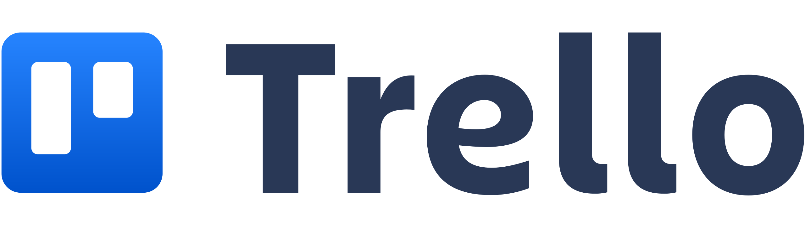

# Documentation technique

## Rappel du cahier des charges

### Introduction
Dans le cadre du cours PDA, nous devions effectuer un projet pendant 9 semaines pour la préparation à notre travail de diplôme. Il nous était demandé d'effectuer une application compatible mobile et d'utiliser un framework à choix.

#### But du projet
Le but de mon projet est de réaliser une application WEB avec Python Flask. L'application doit permettre l'affichage de graphique avec la librairie Chart.JS.

#### Contraintes techniques
Pour ce projet, nous devions utiliser un framework de notre choix. L'application réaliser doit également être compatible mobile.

### Analyse

#### Technologies 
* Python
* Python Flask
* Chart.js
* Mkdocs Markdown(Documentation)
* Github (versionning, task manager)
* Trello
* Ordinateur de type PC, 2 écrans
* Visual Studio Code

<DIV STYLE="page-break-before:always"></DIV>

##### React JS
{width="100"}

React est une bibliothèque JavaScript développée par Facebook depuis 2013. Le but principal de cette bibliothèque est de faciliter la création d'application web monopage, via la création de composants dépendant d'un état et générant une page HTML à chaque changement d'état. J'avais fait le choix de partir sur React à la base mais je suis vite revenu sur ma décision pour m'orienter sur Python Flask.

##### Python Flask
Flask est un micro-framework python facile et simple d'utilisation qui permet de faire des applications web évolutives. Flask dépend de la boite à outils WSGI de [Werkzeug](https://werkzeug.palletsprojects.com/en/2.0.x/) et du moteur de templates [Jinja](https://jinja.palletsprojects.com/en/3.0.x/). J'ai fait le choix d'utiliser Python Flask pour mon application car pour mon travail de diplôme j'utilise beaucoup de Python et je trouvais cohérent d'utiliser ce framework Python qui permet de réaliser une application WEB.

###### Avantages
Flask a été conçu pour être un micro-framework simple et léger. Son but premier est de permettre de démarrer le développement d'une application web sur une base solide sur laquelle appuyer le reste des phases de développement. A partir de cette base, il est possible de construire son projet bloc à bloc, selon les besoins. 

Pour le développeur, Flask est synonyme de totale liberté. Il maîtrise en effet parfaitement son code puisqu'il l'écrit lui-même et n'a pas à plonger dans la compréhension de fonctionnalités préfabriquées comme ce peut être le cas avec des frameworks plus complets.

###### Inconvenient
Étant un micro framework, Flask ne propose pas beaucoup de fonctionnalités de haut niveau. Il faut également comprendre le système de routes utilisé avec Flask.

###### Installation
Pour installer Flask il suffit d'entrer la commande : 
```
pip install Flask
```

##### Micro framework
Un micro framework est un framework qui tente de fournir uniquement les composants absoluments nécessaires à un développeur pour la création d'une application. Par exemple dans le cas d'une application Web, un micro framework peut être spécifiquement conçu pour la construction d'API pour un autre service/application.

Le terme *micro* dans le micro framework signifie que Flask vise à garder le code de base simple mais extensible. Flask ne prendra pas beaucoup de décisions, par exemple quelle base de données utiliser. Les décisions qu'il prend, telles que le moteur de templates à utiliser, sont faciles à modifier. Tout le reste est libre, de sorte que Flask puisse répondre à tous nos besoins et à tous ce que vous ne voulez pas en même temps.

En définissant uniquement le moteur de templates et un système de routes, Flask laisse le choix de personnaliser (en ajoutant des packages) pour la gestion des formulaires par exemple.

<DIV STYLE="page-break-before:always"></DIV>

##### Chart.JS


Chart.js est une librairie open source, elle permet la visualisation de données en utilisant JavaScript. Elle est similaire à *Chartist* ou *Google Chart*. Chart.js supporte 8 différents type de graphique et sont tous responsive. Pour pouvoir utiliser Chart.js il faut :

* Definir ou dessiner le graphique sur notre page
* Definir quel type de graphique afficher
* Definir les données, labels et toutes les autres options

Voici un exemple de graphique que peut générer chart.js : 


<DIV STYLE="page-break-before:always"></DIV>

##### SQL Alchemy


SQLAlchemy est un toolkit open source SQL et un mapping objet-relationnel écrit en Python. Il utilise le pattern Data Mapper au lieu de l'active record utilisés par de nombreux autres ORM.

###### Installation
Pour installer SQLAlchemy il faut exécuter la commande : 
```
pip install sqlalchemy
```
Il est généralement recommandé d'utiliser une bibliothèque supplémentaire :
```
pip install flask-sqlalchemy
```

###### Exemple d'utilisation
Dans mon application, SQLAlchemy est utilisé pour créer et gérer toutes les tables de la base de données. Exemple de modèle (pour la table utilisateur): 


##### Trello 
{width="300"}

Trello est un outil de gestion de projet en ligne, lancé en septembre 2011 et inspiré par la méthode Kanban. Il repose sur une organisation des projets en planches listant des cartes, chacune représentant des tâches. J'ai choisi d'utiliser Trello car c'est le seul outil de gestion de projet que l'on a pu survoler durant le cours et je ne voulais pas m'attarder à apprendre l'utilisation d'un autre outil.


#### Environnement de développement
Pour l'environnement de développement, j'ai utilisé Visual Studio Code

## Analyse fonctionnelle

### Interface
L'interface réalisée pour cette application est très basique, j'ai utilisé Bootstrap 5.

L'application possède, pour le moment, uniquement 4 pages : 

Page d'inscription :


La page comporte un simple formulaire d'inscription.

Page de connexion : 


La page comporte un simple formulaire de connexion

Page tableau de bord :


La page comporte un tableau de bord avec toutes les informations du compte connecté. Un graphique est affiché avec Chart.js affichant des données sauvegardé en base. La photo de profil est affichée sur la droite (Si aucune photo n'a été importée par l'utilisateur, une photo de base est utilisée). Un formulaire de mise à jour est disponible en bas de la page pour mettre à jour son profil :


Page workouts : 


La page comporte un tableau qui affiche les données des entrainements effectués par l'utilisateur.

### Fonctionnalités

#### Login/Register
L'application permet de se connecter et si l'utilisateur ne possède pas encore de compte, d'en créer un. Le formulaire d'inscription comporte plusieurs champs : 

* Nom
* Pseudo
* Email
* Couleur préférée (Utilisée pour la couleur des graphiques)
* Mot de passe

Pour la connexion uniquement l'email et le mot de passe sont demandés.

#### Dashboard
L'application propose un dashboard pour visionner son profil. Toutes les informations du compte sont affichés sur cette page. Un graphique généré par Chart.js affiche les données de l'utilisateur. La photo de profil est affichée (si l'utilisateur n'en a pas importé une photo de base est utilisée).

#### Update
L'application propose un formulaire de mise à jour qui permet de mettre à jour les informations de notre profil. Les informations suivantes sont modifiables :

* Nom
* Pseudo
* Email
* Couleur préférée
* Description
* Photo de profil

#### Logout
L'application possède un bouton de déconnexion.

## Analyse organique
### Architecture
#### Arborescence de fichier


#### static/css/
Dossier contenant les fichiers CSS pour l'application.

#### static/images/
Dossier contenant les images de l'application.

#### static/js/
Dossier contenant les fichiers JavaScript de l'application.

<DIV STYLE="page-break-before:always"></DIV>

#### templates/
Dossier contenant toutes les templates HTML utilisées dans l'application. Toutes les templates sont des extensions de fichier *base.html* qui constitut la base de chaque page : 


<DIV STYLE="page-break-before:always"></DIV>

#### app.py
Fichier Python contenant toutes les routes de l'applications ainsi que les modèles SQLAlchemy utilisés pour la base de données. Exemple de route : 


Lors du login on vérifie si l'utilisateur existe, si oui on vérifie que le hash du mot de passe saisit soit le même que celui enregistré en base. Si ce n'est pas le cas un message d'erreur est affiché.


<DIV STYLE="page-break-before:always"></DIV>

#### create_db.py
Fichier contenant un script Python qui permet de créer la base de données à l'aide de MySQLConnector.


#### webforms.py
Fichier Python contenant tous les formulaires de l'application. Exemple de formulaire (formulaire de connexion) :


<DIV STYLE="page-break-before:always"></DIV>

#### requirements.txt
Fichier Texte contenant toutes les librairies/modules nécessaires pour le fonctionnement de l'application. Pour pouvoir tout installer il suffit d'exécuter la commande : 
```
pip install -r requirements.txt
```


#### mkdocs.yml
Fichier YAML contenant la configuration pour Mkdocs.

#### documentation.md 
Fichier Markdown contenant la documentation technique. Un pdf est généré à partir de ce fichier avec Mkdocs.

#### logbook.md
Fichier Markdown contenant un détail de l'activité journalière pendant le projet. Un pdf est généré à partir de ce fichier avec Mkdocs.

#### specification.md
Fichier Markdown contenant le cahier des charges qui explique toutes les attentes par rapport au projet. 


## Conclusion

### Problèmes rencontrés
Le principal problème rencontré a sûrement été le faux départ avec React au départ. J'ai perdu pas mal de temps à essayer d'apprendre comment bien utiliser React. J'ai également perdu 1 semaine de travail après avoir attrapé le Covid-19. Une fois passé sur Python Flask, je n'ai pas vraiment rencontré de problème.

### Améliorations possibles
Il faudrait améliorer l'interface (peut-être utiliser un autre framework que Bootstrap). J'aimerais également pouvoir rajouter un formulaire d'importation pour fichier Excel. Cela représenterait l'upload des programmes par le coach. Il faudrait ensuite afficher les données dans le fichier excel.

### Bilan personnel
J'ai vraiment apprécié de travailler sur ce projet car j'ai pu apprendre comme il le fallait comment utiliser Python Flask et je compte bien l'utiliser pour mon travail de diplôme. J'ai également pu implémenter les graphiques avec la librairie Chart.js qui est également un gros point de mon travail de diplôme. Je regrette de ne pas avoir pu aller un peu plus loin et rajouter encore quelques fonctionnalités, comme la partie **coach* qui n'a pas été implémenté mais dans l'ensemble, je suis quand même satisfait d'avoir pu finir avec une application fonctionnelle avec un framework que je ne connaissais pas à la base.